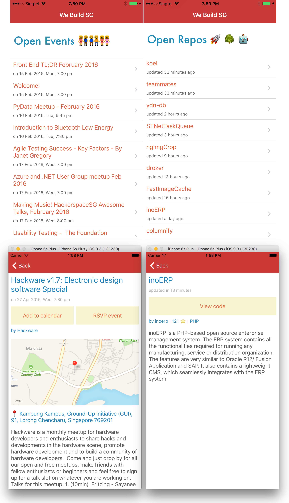

# iOS

> iOS client for iPhone and iPad to display the data from [We Build SG](https://webuild.sg/). Coming to App Store [soon](https://github.com/webuildsg/iOS/issues/5)!

## Quick start

1. Clone with `git clone git@github.com:webuildsg/iOS.git`
- Double click `WeBuildSG.xcworkspace` and open the project in the latest version of Xcode
- Connect your iPhone / iPad and run in the device

## Credits

Thank you:

1. [iOS Stanford lecture 10 by Paul Hegarty](https://itunes.apple.com/en/course/developing-ios-8-apps-swift/id961180099)
- [Stackoverflow answers to my questions](https://stackoverflow.com/users/496797/sayanee?tab=questions)
- [iOS Dev Scout](http://iosdevscout.com/)

## License

MIT
