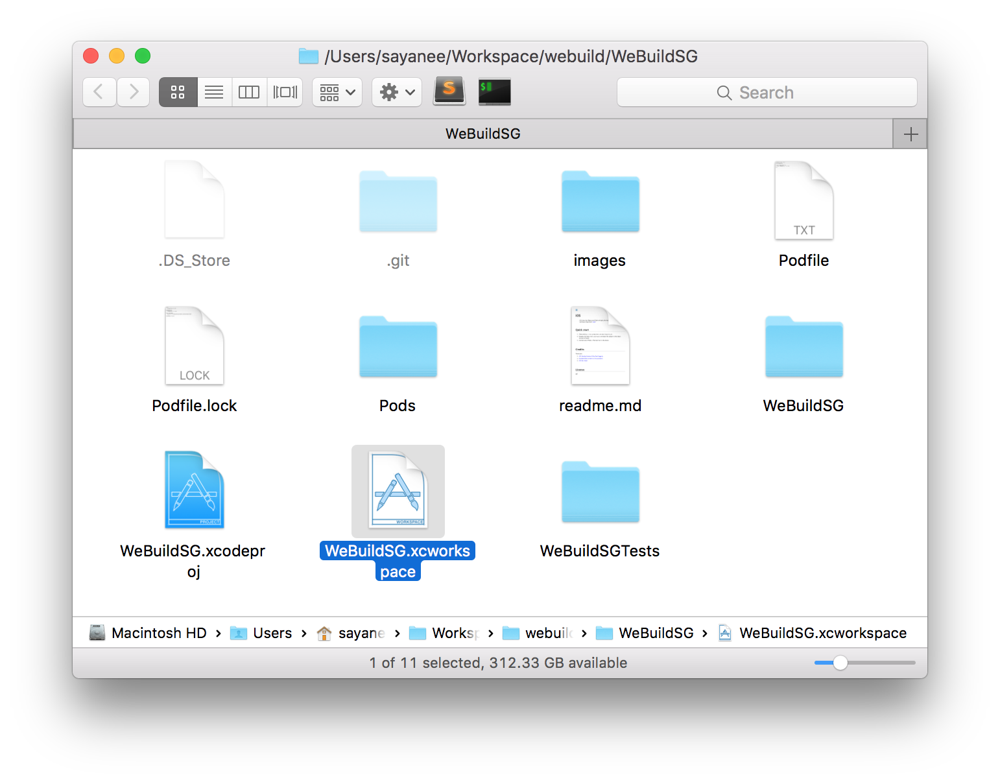
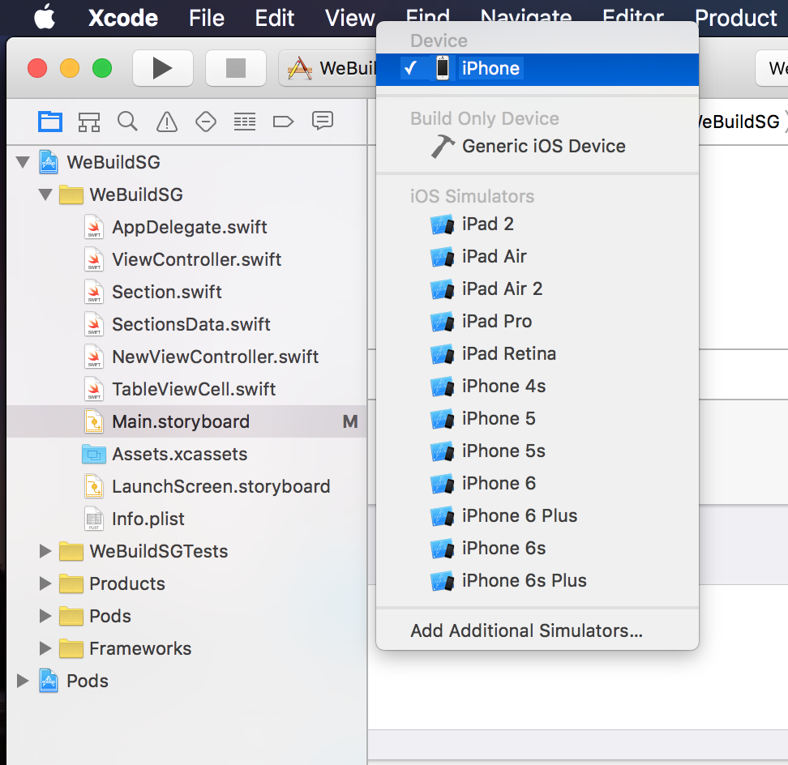

# iOS

> iOS client for iPhone and iPad to display the data from [We Build SG](https://webuild.sg/). Download from the [App Store](https://itunes.apple.com/us/app/we-build-sg/id1089421487?mt=8)!


## Quick start

*Note: You do not need to have the Apple developer program to run in your device. Just connect your iPhone / iPad* :cool:

1. Clone with `git clone git@github.com:webuildsg/iOS.git` or [Download ZIP](https://github.com/webuildsg/iOS/archive/master.zip)
- `cd` to the directory `iOS` and install the dependancies with [RubyGem](https://rubygems.org/)

  ```shell
  sudo gem install cocoapods
  pod install
  ```
- Double click `WeBuildSG.xcworkspace` and open the project in the latest version of Xcode

  
- Connect your iPhone / iPad and run in the device

  

## Credits

Thank you:

1. [iOS Stanford lecture 10 by Paul Hegarty](https://itunes.apple.com/en/course/developing-ios-8-apps-swift/id961180099)
- [Stackoverflow answers to my questions](https://stackoverflow.com/users/496797/sayanee?tab=questions)
- [iOS Dev Scout](http://iosdevscout.com/)

## License

MIT
